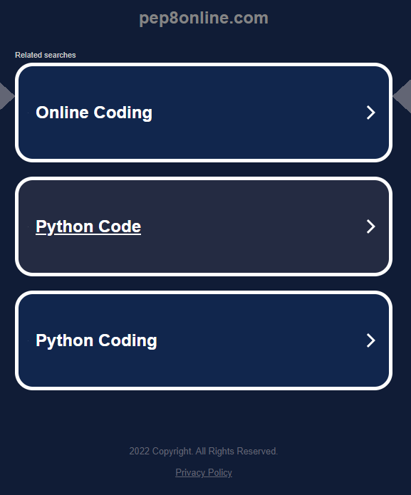

# Pub Quiz Challenge

## Overview
A Python terminal game for uesers to test their knowledge in 5 areas: -

- Science
- Sports
- Movies & TV
- Music
- History

Game developed by Tom Manahan for Code Institute Project Portfolio 3 using Python.

[Live Game Link](https://pub-quiz-challenge.herokuapp.com/)

## Table of contents

1.  [How to play](#how-to-play)

2.  [Project Goals](#project-goals)
    - [Main Goals](#main-goals)
    - [Target Audience](#target-audience)

3.  [Features](#existing-features)
    - [Start Screen](#welcome-screen)

4.  [Future Features](#possible-future-features)

5.  [Technologies](#technologies)
    - [Platforms](#platforms)
    - [Python Modules](#python-modules)

6.  [Flow Chart](#flow-chart)

7.  [Testing](#testing)
    - [Validator Testing](#validator-testing) 
    - [Testing User Stories](#testing-user-stories)
    - [Function And Bug Testing](#function-and-bug-testing)

8.  [Deployment](#deployment)   

9. [Credits](#credits)

10. [Acknowledgements](#acknowledgements)

## How to play 
The Pub Quiz Challenge is a basic terminal game designed to test user's knowledge in the style of a pub quiz.

There are five ares of expertise to choose from. 

At the the start of the game the user is presented with the welcome screen and asked to enter their name.

Once a name is entered, the user must then select form the list of five topics to start the game.

The game presents the user with a question and three options to choose from for the answer.

The user must select an answer from the options by entering A, B or C.

A message is the displayed to let the user know if they are correct or not, and the score increments by 1.

When all questions are answered, the total score is displayed as a percentage of correct answers and the user may select to play again or quit.

If play again is chosen, the quiz restarts and the user enters their name again and has the option to pick the same or another topic.

[Top of page](#pub-quiz-challenge)

## Project Goals

 This project was created for Code Institute's full stack software development course for Portfolio Project 3

 - ### Main goals
  
   - Create a functional terminal game using the Python language.

   - Make the game user friendly and easy to understand while still presenting a challenge

   - Implement technologies learned from the Python module such as Lists, Dictionaries, functions etc.

 - ### Target audience

   - Users with an interest in quizzes

   - Users who want to test their general knowledge

   [Top of page](#pub-quiz-challenge)

## Existing Features

 ### Welcome screen

  When the 'Run Program' button is clicked on the Heroku mock terminal screen, the user is presented with the start screen.

  The start screen features a "Pub Quiz" ASCII text message and a message welcoming the user and asks the user to enter their name.

   - When the user enters their name, they are then presented with a message to select one of 5 topics.
   - The user inputs 1,2,3,4 or 5.

  
  
  The user is presented with a message displaying their choice.

  The quiz then starts and presents the user with the first question from their chosen topic with the three possible answers.

  All questions and answers are stored on a Google Sheets worksheet and accessed through the Google Cloud API services.
  
  Credentials are stored in the creds.json file to allow access to Google drive and spreadsheets from the app.

  

  After each question is answered, a message is displayed telling the user if the chosen answer was correct or incorrect.

  The quiz then moves on to the next question and this pattern continues until all questions are answered.

  A this point the user's score is displayed and the user is asked if they would like to play again.

  If 'Y' is entered, the quiz restarts and the user enters their name again and selects the same or a new topic.

  If 'N' is entered, a 'Goodbye and thanks for playing' message is displayed and the application stops.

  

  Clicking the 'RUN PROGRAM' button will restart the application again.

  [Top of page](#pub-quiz-challenge) 

## Possible Future Features

 Some possible features that could be implemented into the game in the future are

   - Add a leaderboard using player names and scores

  [Top of page](#pub-quiz-challenge) 

## Technologies

 ### Platforms

   - Python was the programming language used to create this project.

   - [Heroku](https://www.heroku.com/) was the platform used to deploy the project.

   - [GitHub](https://github.com/) and Git were used for version control on the project.

   - [Gitpod](https://www.gitpod.io/) was the I.D.E used to create the project.

 ### Python Modules

   - [Gspread](https://pypi.org/project/gspread/) was imported to access Google worksheet

   - [Google credentials](https://developers.google.com/workspace/guides/create-credentials) was imported to verify access

   [Top of page](#pub-quiz-challenge)

## Flow Chart

 The flow chart below represents the structure of the quiz application and how each feature interacts.

 

 [Top of page](#pub-quiz-challenge)

## Testing

 ### Validator Testing

  - PEP8online Python validator link on the Code Institute Portfolio Project Scope page would not work for me and just brings me to a page with ads

  
  
  - No errors or warnings were found when putting the code through the CI Python Linter

  

  - Also no errors returned when checking syntax on Python Syntax Checker

  

 ### Bug testing

  - At first there were a lot of "line too long" errors which were solved either by shortening lines of code, where possible, or
    rewriting code in a different way i.e. creating nested lists.

  - Had an issue when testing on Heroku where text was not displaying correctly and went back through the Love Sandwiches walkthrough project and found that the new line method was required at the end of input methods

  [Top of page](#pub-quiz-challenge)

## Deployment

  The following steps were used to deploy this project to [Heroku](https://www.heroku.com/) 

   - Go to Heroku and click on the new button in the top right corner of the page. Then select create new app from the dropdown menu.

   - Choose an app name, select the region and click create app.

   - Go to settings and select Config Vars

   - Add a new Config Var with a keyword of PORT and a value of 8000

   - Next in settings find Buildpacks and add Buildpacks Python and NodeJS in that order.

   - Exit settings and click Deploy. Select GitHub from the deploy options.

   - Find your repository and connect it to Heroku.

   - Select Manual Deploy from the options, make sure main branch is selected and click Deploy Branch.

   - The live version of the app can be found here [Live Game Link](https://python-blackjack.herokuapp.com/)

   [Top of page](#pub-quiz-challenge)

## Credits

  - [fun quizzes](https://www.funquizzes.uk//pub-quiz-questions) used to get questions for different topics

  - Card suit Unicode symbols were found on Wikipedia [Here](https://en.wikipedia.org/wiki/Playing_cards_in_Unicode)

  - The clear display function was found on geek for geeks [Here](https://www.geeksforgeeks.org/clear-screen-python/#:~:text=You%20can%20simply%20%E2%80%9Ccls%E2%80%9D%20to%20clear%20the%20screen%20in%20windows.)

  - The template used for this project was the Code Institute python essentials template found [Here](https://github.com/Code-Institute-Org/python-essentials-template)

  - The flowchart created for this project was made on [Lucidchart](https://www.googleadservices.com/pagead/aclk?sa=L&ai=DChcSEwjm0IXtxdv7AhUm7-0KHRVNDHwYABAAGgJkZw&ohost=www.google.com&cid=CAESbOD2FmT0TtByzzkK620v_t26vgxZBwp1SyXz5cFeI64MHuAO2lqZGDOZZBd9ZTH5BuNL_bcb_Nr1Z5HKl_aYY9dOpjvjSG3PcPU27A1FbQ5b2_Us-gOYsRmxM1SH0BUrkbAYjVAiG8hA6ifQ2A&sig=AOD64_2FaTT_YSoGZDvf3kC_eU4DD5hjRw&q&adurl&ved=2ahUKEwiA0P7sxdv7AhUCYcAKHQmCCdQQ0Qx6BAgJEAE)

  - The linter used for code validation was the CI Python Linter found [Here](https://pep8ci.herokuapp.com/)

  - The idea of how to set up the deck and dictionary values for cards were Found on Dave Crabbes youtube video [Here](https://www.youtube.com/watch?v=SHz5cUeljZw)

  - [Stack Overflow](https://stackoverflow.com/) was used for solutions for various bug fixes.

  - [W3Schools](https://www.w3schools.com/) was used for research on various syntaxes.

  - [Grammarly](https://www.googleadservices.com/pagead/aclk?sa=L&ai=DChcSEwjGsafOh9_7AhUJl-0KHQmxCicYABAAGgJkZw&ohost=www.google.com&cid=CAESbOD2Xcxc5xKr6RvUm7TpPwpbCU10LjQrGKOUpXrGNnyNWmaO2Zk_y3dAnW0mpTc0x3-DbRTeK6OH9zUg9xamXSqmNqv6wX1BoWxsXzUdK4K_UGDr0UcXNmNKVLXoTN8VKvjK_8V0CSW2WZ2Chg&sig=AOD64_2EL-jS1jY_9um_H6eqlNDcftFF3Q&q&adurl&ved=2ahUKEwjs2qHOh9_7AhWGI8AKHbzkBSwQ0Qx6BAgHEAE) was used for the README spell and grammar checks.

  [Top of page](#pub-quiz-challenge)

## Acknowledgements

 - To my classmates Sean Finn and Victoria Traynor who helped review my project along the way and discussions about various issues and bugs.

 - To the slack community as a whole for help and support throughout the whole project.

 - To my friends, family and in particular my fiancee Sinead for support throughout the project.

 [Top of page](#pub-quiz-challenge)
